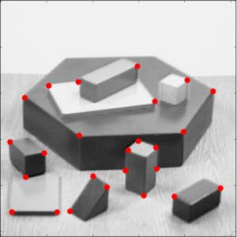

<p align="center">
  <h1 align="center">harris</h1>
</p>

<p align="center">
    
</p>

> Detect corners of an image using the Harris Corner Detector technique

### Clone
- Clone this repo to your local machine using `https://github.com/gurveerdhindsa/harris.git`

### Run
```
python harris.py
```

##  Support
- Website at <a href="https://gurveerdhindsa.ca" target="_blank">`gurveerdhindsa.ca`</a>